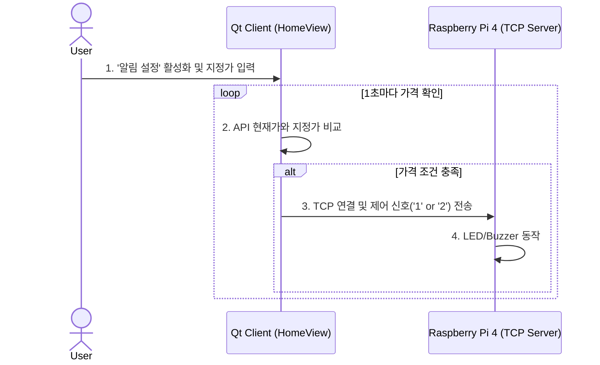

# K Coin - Ex
> 처음 만나는 가장 심플한 나의 첫 가상화폐 거래소

`K Coin - Ex`는 C++와 Qt 프레임워크를 기반으로 개발된 미니 가상화폐 거래소 데스크탑 애플리케이션입니다. 기존의 파일 기반 프로젝트("K Coin")를 **MariaDB** 기반으로 확장(**Ex**tended)하고, 실제 거래소(**Ex**change)의 핵심 기능을 강화했습니다.

단순한 모의 투자를 넘어, 안정적인 데이터 관리, 하드웨어(라즈베리파이)와의 연동, 커뮤니티 기능, 그리고 기본적인 보안까지 고려한 Full-Stack 프로젝트입니다.

<br>

## ✨ 주요 기능 (Features)

| 기능 | 상세 내용 |
| :--- | :--- |
| **📈 실시간 시세 및 차트** | Bithumb RESTful API와 연동하여 코인 시세를 실시간으로 받아오고, **Qt Charts**를 이용해 라인 차트와 캔들 차트로 시각화합니다. |
| **🗄️ 데이터베이스 연동** | 기존의 JSON 파일 저장 방식에서 벗어나 **MariaDB**를 도입했습니다. 사용자 정보, 거래 내역, 채팅 로그, 게시글 등 모든 데이터를 안정적으로 관리합니다. |
| **🔔 IoT 지정가 알림** | 사용자가 지정한 가격에 코인 시세가 도달하면, **라즈베리파이4에 연결된 LED와 피에조 부저**가 시각 및 청각적 알림을 제공합니다. |
| **📝 커뮤니티 게시판** | 사용자 간의 정보 교환을 위한 게시판 기능을 제공합니다. (글 생성, 조회, 삭제 기능 구현) |
| **💬 실시간 채팅** | 멀티 스레드 기반의 TCP 서버를 통해 다수의 클라이언트가 동시에 참여할 수 있는 실시간 채팅 기능을 지원합니다. |
| **🛡️ 보안 강화** | - **SQL Injection 방지**: `QSqlQuery::bindValue()`를 사용한 Prepared Statement 적용<br>- **DoS 공격 방지**: 채팅 메시지 전송률 제한(Flood Protection) 로직 구현 |

<br>

## 🛠️ 기술 스택 (Tech Stack)

### **Backend & Server**


- **Language**: `C++17`
- **Framework**: `Qt 6` (`QtCore`, `QtGui`, `QtWidgets`, `QtNetwork`, `QtSql`, `QThread`)
- **Architecture**: Multi-threaded TCP/IP Server
- **Database**: MariaDB
- **Design Patterns**: Singleton, Producer-Consumer

### **Frontend & Client**


- **Framework**: `Qt 6` (`QtWidgets`, `QtCharts`)
- **Architecture**: Model-View (MV) Pattern

### IoT & Others


- **Hardware**: Raspberry Pi 4
- **IoT Server**: C TCP Socket Server (for GPIO control)
- **API**: Bithumb RESTful API

<br>

## 🚀 시작하기 (Getting Started)

### **Prerequisites**
- Qt 6.9.0 / 6.9.1
- C++17 compatible compiler (MSVC, GCC, Clang)
- MariaDB Server
- Qt MySQL Driver

### **설치 및 실행 (Installation & Run)**
1.  **Clone the repository:**
    ```bash
    git clone https://github.com/your-username/k-coin-ex.git
    cd k-coin-ex
    ```

2.  **데이터베이스 설정:**
    - **!!!!! MariaDB에 프로젝트에서 사용할 데이터베이스와 사용자를 생성이 필요합니다 !!!!!**
      
    - `ServerManager.cpp` 파일 내의 DB 연결 정보를 자신의 환경에 맞게 수정합니다. [
    ```cpp
    // ServerManager.cpp
    db.setHostName("YOUR_DB_HOST");
    db.setDatabaseName("YOUR_DB_NAME");
    db.setUserName("YOUR_DB_USERNAME");
    db.setPassword("YOUR_DB_PASSWORD");
    ```


3.  **프로젝트 빌드 및 실행:**
    - Qt Creator에서 `k-coin-ex.pro` 파일을 열고 프로젝트를 빌드합니다.
    - 먼저 **Server** 프로젝트를 실행
      
    - `loginview.cpp` 자신의 환경에 맞게 수정합니다. [
    ```cpp
    // loginview.cpp
    socket->connectToHost("YOUR_HOST", 51234);
    ```
    
    - 그 다음 **Client** 프로젝트를 실행합니다.

<br>

## 📊 아키텍처 (Architecture)

### **System Flow**


### **지정가 알림 시스템 동작**


<br>

## 👤 개발자 (Contributor)

- **[형건우](https://github.com/Henry93s)**
- **[김선권](https://github.com/kimsungwon1)**
- **[최현구](https://github.com/Hyun-nine-CH)**

---
*This project was created for educational and portfolio purposes.*
